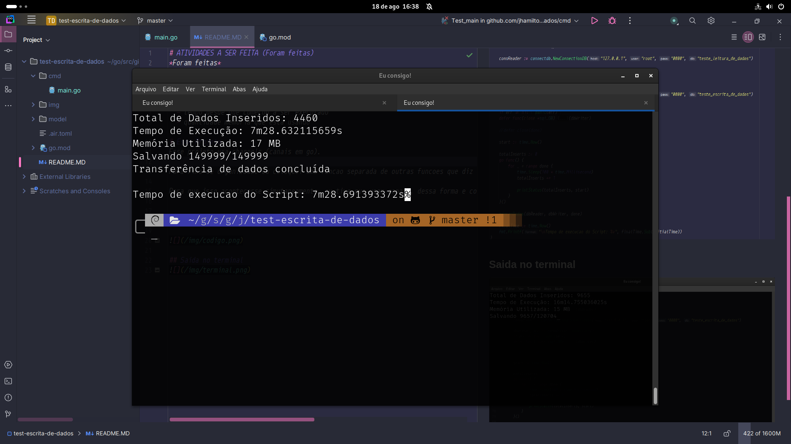

# ATIVIDADES A SER FEITA (Foram feitas)
*Foram feitas*
- mudar a conexao como o banco de dados, retirar de dentro da funcao 
  - devo retirar essa responsabilidade da funcao
- manipular o terminal 
  - ele deve exibir a quantidade de dados que esta sendo salvo
  - tempo desde que comecou a ser executado
  - quantidade memoria que esta usando

# Esse Projeto
Esse projeto usa channels (canais em go).

Para fins de organizadao eu coloquei uma funcao separada de outras funcoes que diz o tempo que o progrma esta sendo executado e uso de memoria ram.

Para que isso acontecesse simutaneamente, eu tive que usar canais, dessa forma e consigo fazer com que a mensage `Salvando 90/100000` aprecesse logo apois os status

## Um pouco do codigo main

## Com melhoria segundo o proximo print do terminal
Note que antes levou 16 minutos para inserir apenas 9 mil itens, neste foi menos da metade do tempo e inseri 149 mil registros

## Saida no terminal
